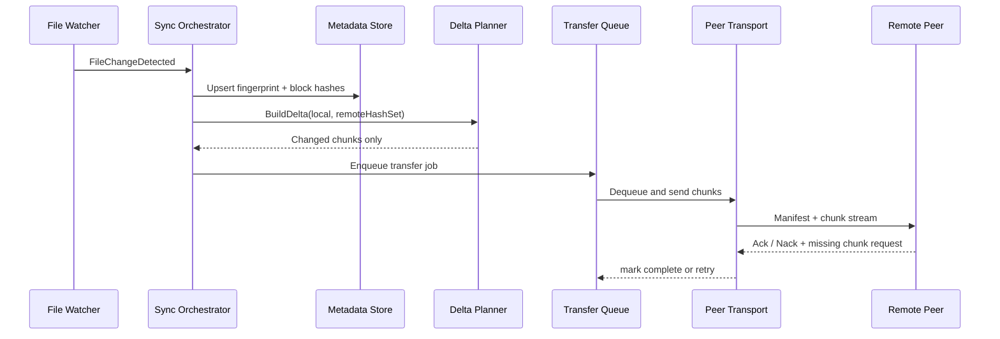
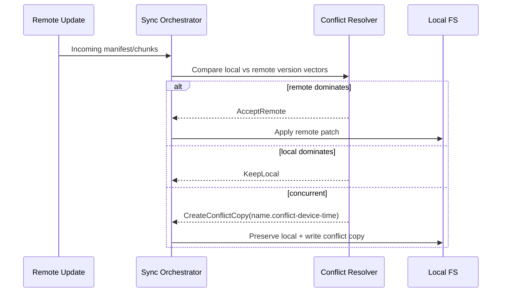
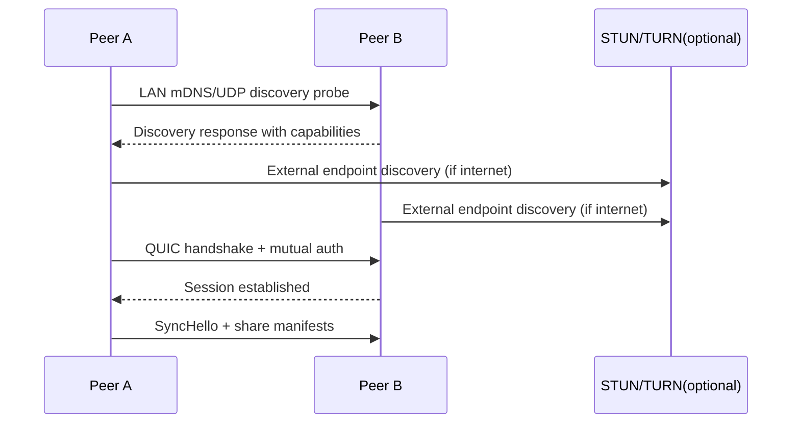

# F2Share Architecture (Production Design)

## 1. System Overview

F2Share is a fully decentralized P2P folder synchronization system.
Each node runs the same stack and can simultaneously act as:

- discovery broadcaster/listener
- transport listener/dialer
- sync producer (local file changes)
- sync consumer (remote incoming changes)

No central file server exists. Optional STUN/TURN relay bootstrap can be introduced for hostile NAT environments while preserving decentralized file ownership.

## 2. Clean Architecture Layout

- Domain:
  - entities: sync item, peer profile, conflict aggregates
  - value objects: version vectors, fingerprints
  - domain services: conflict policy
- Application:
  - sync orchestration
  - change debounce and event normalization
  - delta transfer planning and queueing
  - background workers
  - abstraction contracts for infrastructure
- Infrastructure:
  - file watcher adapters
  - hash/chunker implementation
  - SQLite metadata store and retry queue persistence
  - LAN discovery adapter
- Transport:
  - MessagePack binary protocol contracts
  - QUIC transport implementation
- Desktop:
  - Avalonia UI and diagnostics

## 3. Module Responsibilities

- Watcher pipeline: captures create/modify/delete/rename events, normalizes, debounces.
- Sync orchestrator: computes fingerprints, plans deltas, persists metadata, enqueues transfer jobs.
- Transfer scheduler: durable queue + retry backoff.
- Peer transport: encrypted QUIC streams and envelope dispatch.
- Conflict resolver: version vector comparison and deterministic conflict naming.
- Metadata store: persistence for file fingerprints, queue states, and history.

## 4. Sequence Diagrams

### 4.1 Synchronization Flow

### 4.2 Conflict Flow

### 4.3 P2P Connection Flow

## 5. Database Schema (SQLite)

Primary tables:

- file_fingerprints:
  - share_id, relative_path (PK)
  - length, last_write_utc, strong_hash, block_hashes
  - is_deleted
- sync_queue:
  - pending transfer actions
  - retry_count and next_attempt_utc for backoff

Recommended additional production tables:

- peers (trust state, fingerprints, endpoint history)
- transfer_sessions (resumable checkpoints)
- conflict_history
- file_versions
- metrics_rollups

## 6. Internal Messaging/Event Bus

Use bounded channels per pipeline stage:

- watcher-events channel
- normalized-events channel
- transfer-queue channel
- outbound-network channel
- inbound-network channel

Backpressure strategy:

- bounded channels for memory control
- high-priority control channel for acks/retries
- drop/coalesce policy for repeated modify events within debounce window

## 7. Protocol Contracts

Binary format: MessagePack (or protobuf interchangeable at transport boundary).

Envelope:

- fromDeviceId
- toDeviceId
- messageType
- payload
- createdAtUtc

Message types:

- HelloMessage
- SyncManifestMessage
- ChunkTransferMessage
- AckMessage

## 8. Reliability Strategy

- Durable queue in SQLite with retry policy.
- Exponential backoff with jitter.
- Resumable transfers tracked by last acknowledged chunk offset.
- Crash-safe startup recovery:
  - recover pending queue
  - re-run incomplete sessions
- Offline peer buffering and replay when reconnecting.

## 9. Security Strategy

- TLS 1.3 over QUIC for transport encryption.
- Mutual authentication via pinned peer identity keys.
- Optional room key to authorize cluster membership.
- Replay resistance via nonce/timestamp checks.
- Signed manifests/chunk frames to protect integrity.
- Restrict accepted paths to rooted share boundaries.

## 10. Performance Design

- Event-driven watcher, not scan-first.
- Block-level delta transfer.
- Hash cache keyed by (path, size, mtime, inode/file-id).
- Parallel chunk upload/download with dynamic window sizing.
- Adaptive throttling based on RTT, packet loss, and CPU pressure.
- Intelligent batching for tiny file storms.

## 11. Scalability Notes

- Separate queue partitions per peer/share.
- Avoid loading full index into memory; stream from DB.
- Use pooled buffers and ArrayPool for chunking.
- Large file pipeline:
  - read-stream hash
  - direct chunk pipeline
  - no whole-file buffering

## 12. Deployment and Packaging

- Publish self-contained binaries per OS:
  - win-x64
  - linux-x64
  - osx-arm64 / osx-x64
- Use code signing for desktop app packages.
- Auto-update channel with signed update manifests.

## 13. Operational Telemetry

- Structured logs (Info/Warning/Error/Critical).
- Metrics:
  - sync latency p50/p95/p99
  - bytes transferred (delta vs full)
  - queue depth
  - conflict rate
  - reconnect frequency
- Diagnostics UI panel surfaces peer health and transfer stats.

## 14. Hardening Checklist

- path traversal protection
- symlink policy controls
- max message/chunk limits
- DoS guardrails (rate limiting per peer)
- lock contention profiling
- chaos testing for network partitions
